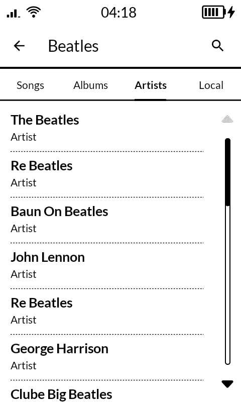
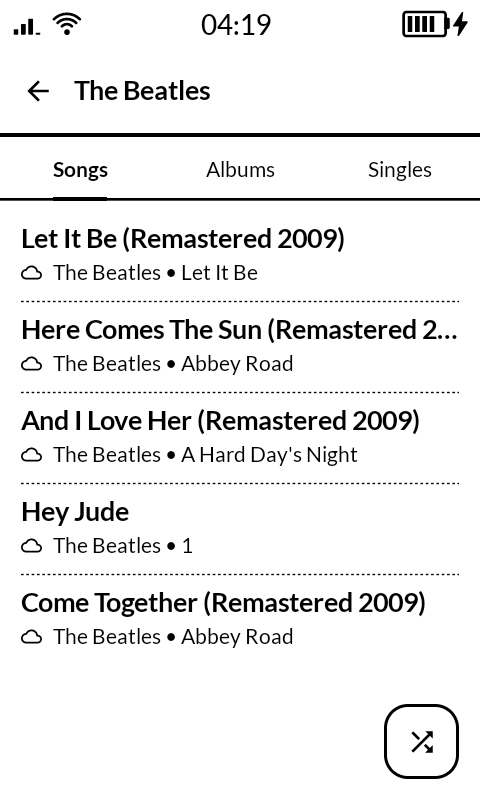
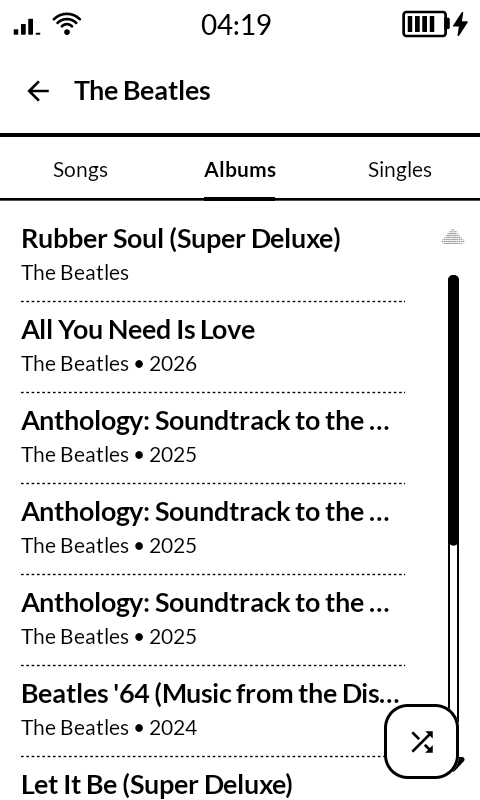
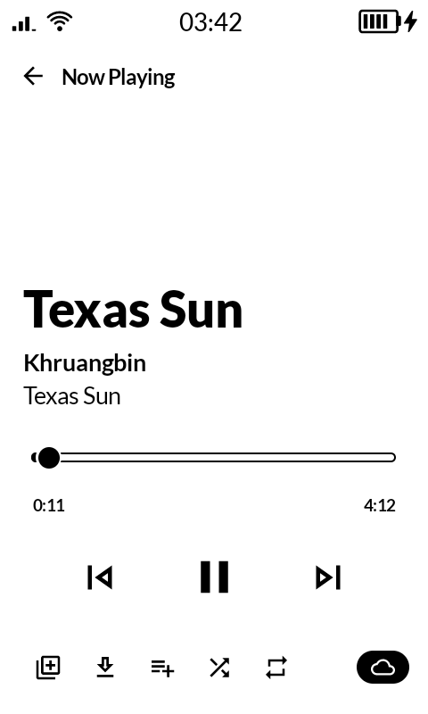
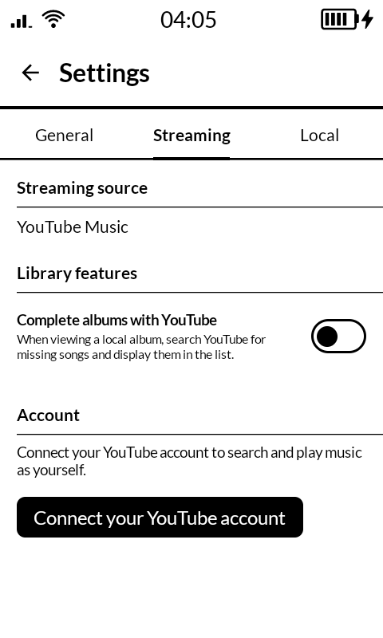

# eInk Music

A calm, e-ink-friendly music player for the [Mudita Kompakt](https://mudita.com/products/mudita-kompakt), combining your local library with YouTube Music search, streaming, and browsing — all in one quiet, distraction-free place.

eInk Music is a fork of [CalmMusic](https://github.com/davidraywilson/CalmMusic) by [David Ray Wilson](https://github.com/davidraywilson), reskinned and adapted specifically for the Kompakt's e-ink display and Mudita's MMD design system. CalmMusic itself is no longer maintained upstream (its author moved on to a different project); this fork keeps the idea alive for the Kompakt.

"Let's make technology useful again."

## Screenshots

<table>
<tr>
  <td></td>
  <td></td>
  <td></td>
</tr>
<tr>
  <td></td>
  <td></td>
</tr>
</table>

## What makes eInk Music different?

- **Built for e-ink** — large text, high contrast, minimal animation, layouts that stay legible at slow refresh rates.
- **Mindful by design** — no feeds, badges, or engagement tricks; just simple screens that do one job well.
- **Privacy-respecting** — no tracking, no analytics SDKs, no ads. Your listening stays on your device.
- **You stay in control** — choose which folders to scan, whether to connect a YouTube account, and what ends up in your library.

## Features

### Local music

- Choose exactly which folders on your device eInk Music is allowed to scan.
- The app indexes supported audio files into a clean library of **songs, albums, artists, and playlists**.
- Local songs play fully **offline**.

### YouTube Music

- Search for **songs, albums, and artists** — no account required for basic search and streaming.
- **Artist pages** show an artist's top songs, albums, and singles/new releases, pulled straight from YouTube Music.
- Optionally **connect your YouTube account** (Settings → Streaming) so search reflects your own account.
- **Complete albums with YouTube** — when viewing a local album, missing tracks are found and filled in from YouTube search.
- Download YouTube tracks for offline playback, with active/recent downloads tracked in a dedicated screen.

> Please respect artists' rights and your local laws when streaming or downloading from YouTube.

### One calm queue for everything

- A single **now-playing queue** that freely mixes local files and YouTube tracks.
- Shuffle and repeat without losing your place.
- A quiet **Now Playing** screen with big typography and minimal chrome.

## Getting started

1. Install eInk Music (Android 9 / API 28 or newer).
2. **Add local music**: Settings → Local → pick folders to scan.
3. **Search YouTube Music**: just start typing in Search — no setup required.
4. **Optional**: Settings → Streaming → Connect your YouTube account.

## Privacy & data

- No account required for local music or YouTube search.
- No ads, no analytics, no tracking SDKs.
- Your settings and local library live only on your device.
- YouTube-related features talk only to YouTube/YouTube Music as needed to search and stream audio.

## For developers

- **Requirements**: Android Studio, JDK 21, Android SDK Platform 37+, a device or emulator running Android 9 (API 28) or newer.
- Clone the repo, open it in Android Studio, let Gradle sync, run the `app` configuration.
- `./gradlew :app:assembleDebug` / `:app:assembleRelease` — build APKs (both build types share a checked-in debug-style keystore; see `app/build.gradle.kts`).
- `./gradlew :app:installDebug` — install on a connected device.

Tagged pushes (`v*`) trigger a GitHub Actions release build that publishes a signed APK to GitHub Releases.

## Credits

- Built on [CalmMusic](https://github.com/davidraywilson/CalmMusic) by David Ray Wilson (GPL-3.0).
- YouTube stream resolution via [MetrolistExtractor](https://github.com/MetrolistGroup/MetrolistExtractor), a NewPipeExtractor fork.
- UI built with Mudita's MMD component library for Kompakt.

## License

GPL-3.0 (see `LICENSE`), same as upstream CalmMusic.
